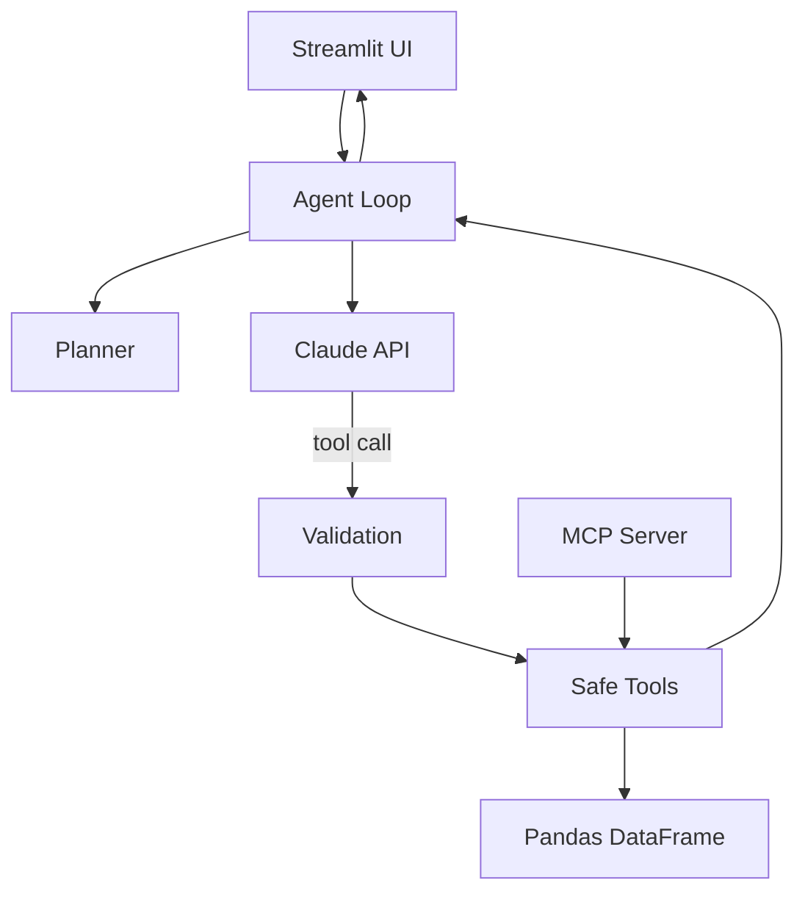

# Project 4 — Data Analyst Agent

A CSV analysis agent that lets you **chat with data** safely. Upload a CSV, ask questions in plain English, and the agent uses a fixed set of safe tools — never arbitrary code.

## Why this matters

Many teams want "chat with data," but naive systems are risky. This project separates **deciding** (the model) from **executing** (your code):

```
User question → Model picks a tool → Your code validates & runs it → Result back to model → Answer
```

That separation is the **safety model**.

## Quick start

```bash
cd 04-data-analyst-agent
python -m venv .venv
.venv\Scripts\activate        # Windows
pip install -r requirements.txt
```

Copy `.env.example` to `.env` and set your Anthropic API key:

```
ANTHROPIC_API_KEY=sk-ant-...
```

### Run the UI

```bash
streamlit run app.py
```

Open http://localhost:8501 — upload a CSV or use the sample `data/sales.csv`.

### Run evaluation

```bash
python evaluate.py
```

### Run injection tests

```bash
python injection_tests.py          # offline sanitization tests
python injection_tests.py --live     # live API injection test
```

### Run MCP server

```bash
python mcp_server.py
```

Exposes 5 tools: `get_schema`, `group_and_aggregate`, `top_n`, `make_chart`, `compare_periods`.

## Example questions

- Which product had the highest revenue?
- Which region is declining fastest?
- Are there outliers?
- Make a chart of monthly sales by region.
- Compare Q2 and Q3 by customer segment.

## Architecture

See [docs/architecture.md](docs/architecture.md) for full diagrams.



| File | Role |
|------|------|
| `app.py` | Streamlit UI with visible agent traces |
| `agent.py` | Tool-calling loop (Anthropic Claude) |
| `planner.py` | Pre-planning step |
| `memory.py` | Embedding-based Q&A recall |
| `tools.py` | Safe tool implementations on pandas |
| `tool_schemas.py` | JSON schemas for the 8 required tools |
| `mcp_server.py` | MCP server (5 tools) |
| `evaluate.py` | 10-task eval suite |
| `injection_tests.py` | Prompt-injection defense tests |


## Required tools (8)

| Tool | Purpose |
|------|---------|
| `get_schema` | Column names, dtypes, row count |
| `profile_dataset` | Summary stats for all columns |
| `describe_column` | Deep dive + outlier detection (IQR) |
| `filter_rows` | Filter with safe operators |
| `group_and_aggregate` | GROUP BY + SUM/MEAN/COUNT/etc. |
| `top_n` | Rank top N by a metric |
| `compare_periods` | Compare two date ranges |
| `make_chart` | Bar/line charts saved to `results/charts/` |

## Safety & limits

| Control | Value |
|---------|-------|
| Max agent steps | 10 (configurable via `MAX_AGENT_STEPS`) |
| Max tokens per task | 8000 |
| Tool allowlist | 8 tools only — no code execution |
| Input sanitization | Injection patterns stripped from string args |
| System prompt | Instructs model to treat data as untrusted |

## Portfolio metrics

| Metric | Target | Where |
|--------|--------|-------|
| Task success rate | ≥ 0.70 | `results/task_success.json` |
| Avg steps per task | < 6 | `results/task_success.json` |
| Max loop limit | 10 steps | `agent.py`, sidebar in UI |
| Injection defense | Before/after documented | `results/injection_report.json` |
| Agent trace visible | Yes | Streamlit UI expanders |
| MCP tools | ≥ 3 | `mcp_server.py` (5 tools) |

## File structure

```
04-data-analyst-agent/
├── data/                  # Sample CSV
├── tools.py               # Safe tool implementations
├── tool_schemas.py        # Tool JSON schemas
├── agent.py               # Agent loop
├── planner.py             # Planning layer
├── memory.py              # Embedding memory
├── mcp_server.py          # MCP server
├── app.py                 # Streamlit UI
├── evaluate.py            # 10-task eval
├── injection_tests.py     # Injection defense tests
├── results/
│   ├── task_success.json
│   ├── traces.jsonl
│   ├── injection_report.json
│   └── charts/
├── requirements.txt
└── README.md
```

## Debugging guide

### Agent returns empty / errors

1. Check `.env` has a valid `ANTHROPIC_API_KEY`.
2. Run `python -c "from agent import DataAnalystAgent; import pandas as pd; ..."` with a simple question.
3. Inspect `results/traces.jsonl` for the full step-by-step trace.

### Tool validation errors

Tools reject unknown columns and operators. Call `get_schema` first to see valid column names.

### Step limit hit

Increase `MAX_AGENT_STEPS` in `.env` or reduce question complexity. The UI sidebar also controls max steps.

### Injection test failures

Run `python injection_tests.py` (offline) first. The `--live` flag tests against the real API.

### Charts not showing

Charts save to `results/charts/`. Ensure the directory exists and `make_chart` was called (check trace).

## What you learn

- Function/tool schemas and structured tool calling
- Agent loops with step and cost limits
- Planning before execution
- Visible execution traces
- Memory through embeddings
- MCP server integration
- Task success evaluation
- Prompt injection defense through data
- Safe tool design (no arbitrary code)

## License

MIT — portfolio project.
