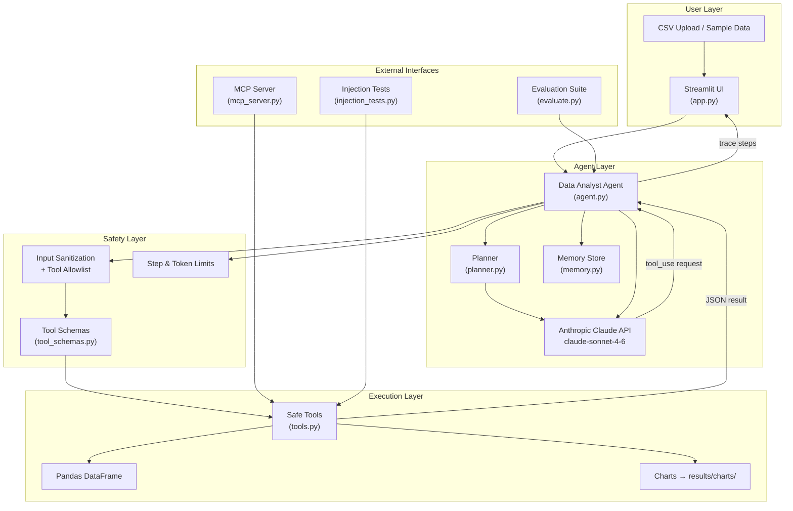
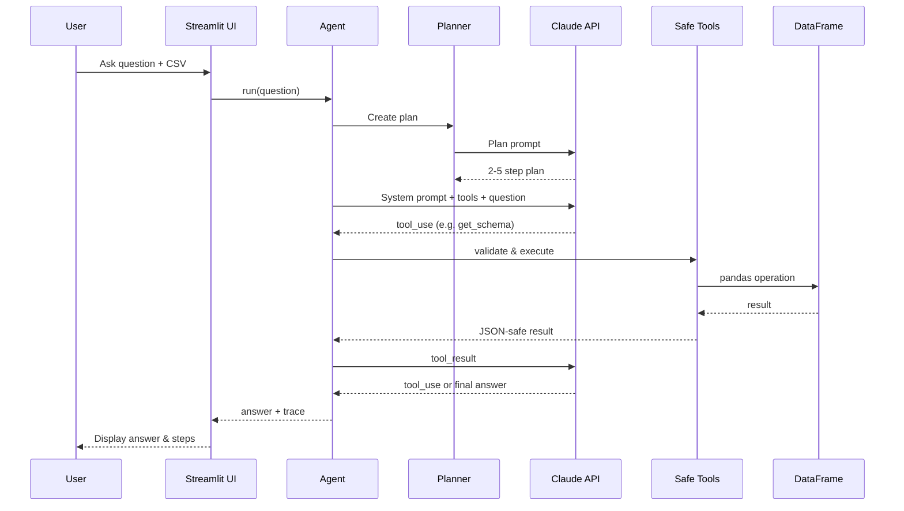
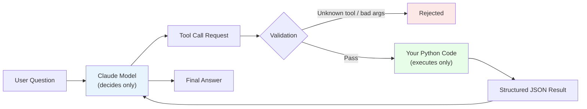
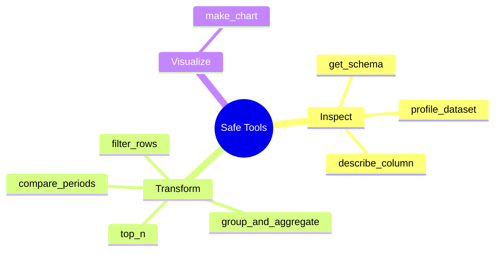

# Architecture — Data Analyst Agent

## System overview

## Data flow (single question)

## Safety model

## Component map

| File | Role |
|------|------|
| `app.py` | Streamlit UI, trace viewer, file upload |
| `agent.py` | Tool-calling loop, step/token limits |
| `planner.py` | Pre-plan before tool execution |
| `memory.py` | Embedding-based Q&A recall |
| `tools.py` | 8 safe pandas tools + JSON sanitization |
| `tool_schemas.py` | Anthropic tool JSON schemas |
| `mcp_server.py` | MCP server exposing 5 tools |
| `evaluate.py` | 10-task success rate benchmark |
| `injection_tests.py` | Prompt-injection defense tests |

## 8 safe tools

